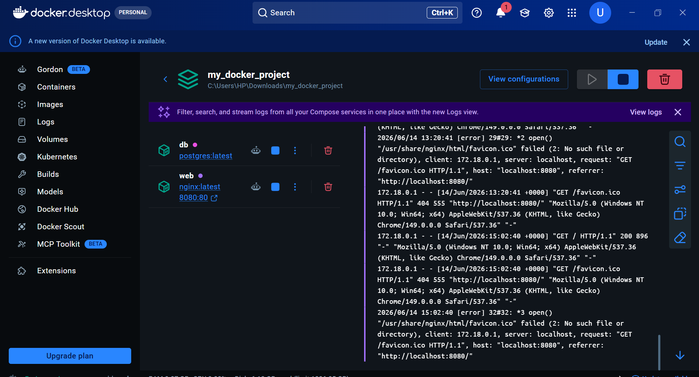
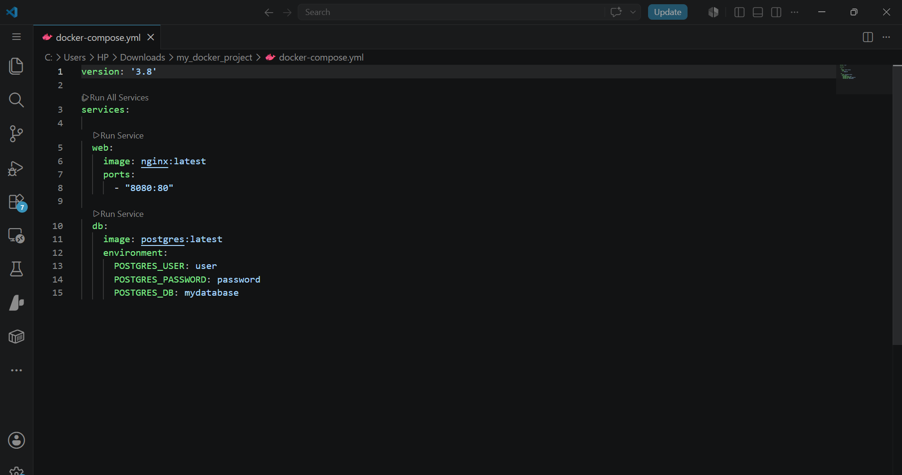
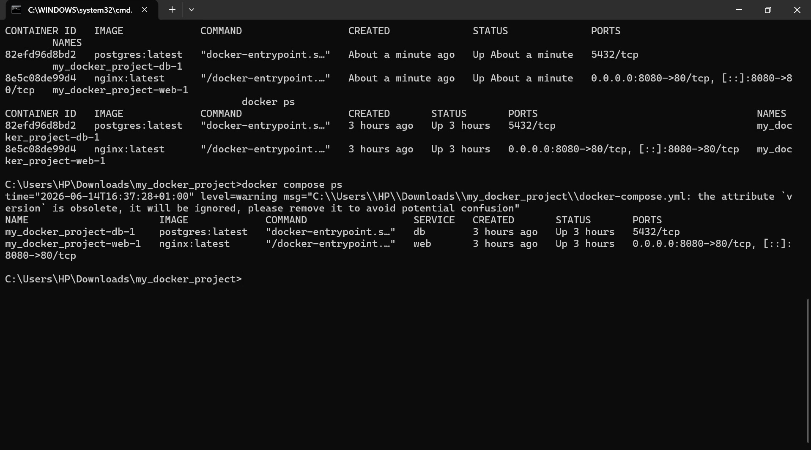
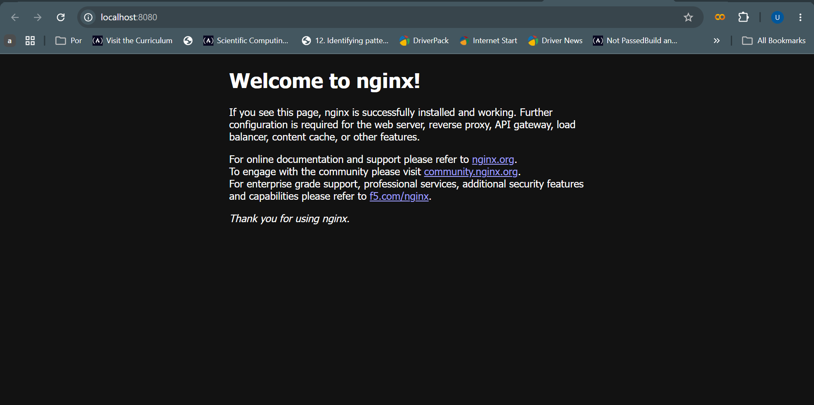

# 🐳 Docker Compose Multi-Container Application


---

# 📌 Project Overview

This project demonstrates how to deploy and manage a multi-container application using Docker Compose.

The application consists of:

- 🌐 Nginx Web Server
- 🗄️ PostgreSQL Database

The goal of this project was to understand how Docker Compose simplifies multi-container deployment using a single YAML configuration file.

---

# 🚀 What I Built

- Docker Compose configuration file
- Nginx web service
- PostgreSQL database service
- Multi-container architecture
- Container networking
- Environment variable configuration
- Reproducible deployment workflow

---

# 📂 Project Structure

```text
my_docker_project/
│
├── docker-compose.yml
│
└── screenshots/
    ├── docker-compose-stack.png
    ├── docker-compose-yml.png
    ├── docker-compose-ps.png
    └── nginx-running.png
```

---

# 🖼️ Project Screenshots

## Docker Compose Services Running



## Docker Compose Configuration File



## Running Containers



## Nginx Welcome Page



---

# 🧠 Key Concepts Learned

| Concept | Explanation |
|----------|-------------|
| Docker Compose | Tool for managing multi-container applications |
| Services | Individual containers defined in a Compose file |
| YAML Configuration | Declarative infrastructure configuration |
| Container Networking | Communication between containers |
| Environment Variables | Application configuration management |
| Port Mapping | Exposing container services |
| Infrastructure as Code | Managing environments through code |

---

# 🔍 Docker Compose Configuration

```yaml
version: '3.8'

services:
  web:
    image: nginx:latest
    ports:
      - "8080:80"

  db:
    image: postgres:latest
    environment:
      POSTGRES_USER: user
      POSTGRES_PASSWORD: password
      POSTGRES_DB: mydatabase
```

---

# 🏗️ Architecture

```text
Browser
   │
   ▼
Nginx Container
   │
   ▼
PostgreSQL Container
```

---

# ▶️ Commands Used

## Start Services

```bash
docker compose up -d
```

## Check Running Services

```bash
docker compose ps
```

## View Logs

```bash
docker compose logs
```

## Stop Services

```bash
docker compose down
```

---

# 🌐 Access the Application

Open your browser and visit:

```text
http://localhost:8080
```

Expected Output:

```text
Welcome to nginx!
```

---

# 💭 Business Value

Docker Compose allows developers to deploy and manage multiple services from a single configuration file.

Benefits include:

- Faster deployment
- Reduced configuration errors
- Improved developer productivity
- Consistent environments across teams
- Easier onboarding of new developers

---

# 📚 Technologies Used

- Docker
- Docker Compose
- Nginx
- PostgreSQL
- YAML

---

# 🎯 Skills Demonstrated

- Docker Fundamentals
- Docker Compose
- Container Networking
- Multi-Container Applications
- Infrastructure as Code (IaC)
- Service Configuration

---

# 👨‍💻 Author

**Wisdom Oghenevwede Uti**

Aspiring Data Engineer | ALX Data Science Learner

Building skills in Docker, Python, SQL, Cloud Computing, Data Engineering, and Modern Data Platforms.
